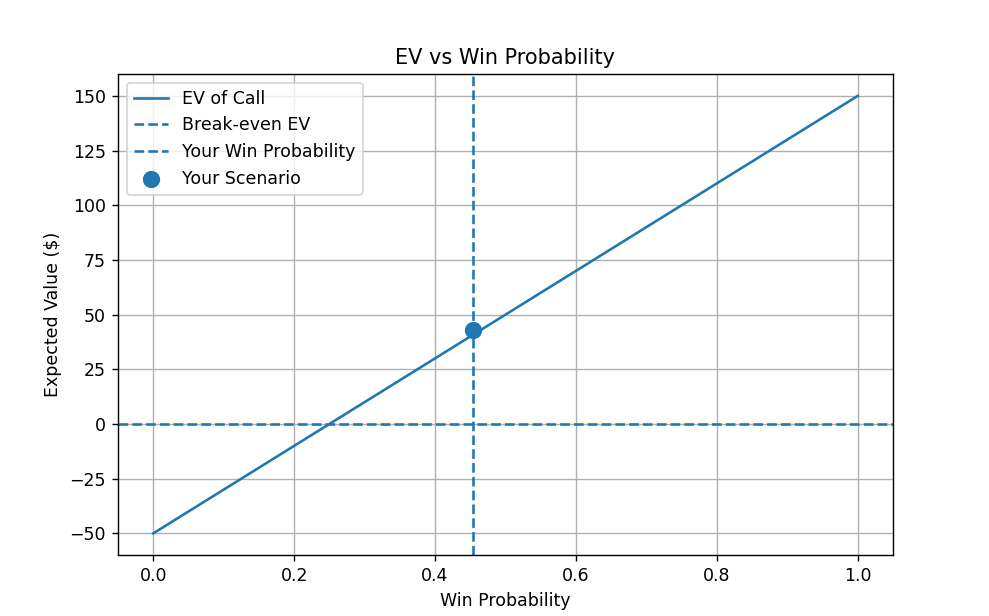

## Expected Value Analysis

This graph shows how expected value (EV) changes as win probability increases.  
The break-even point occurs where EV = 0.
(this graph was created assuming your dealt cards were Ts 7h pre-flop and $50 to call)

